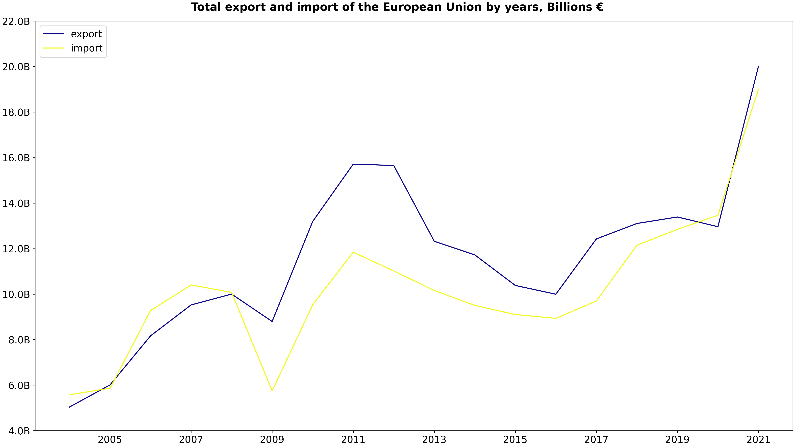
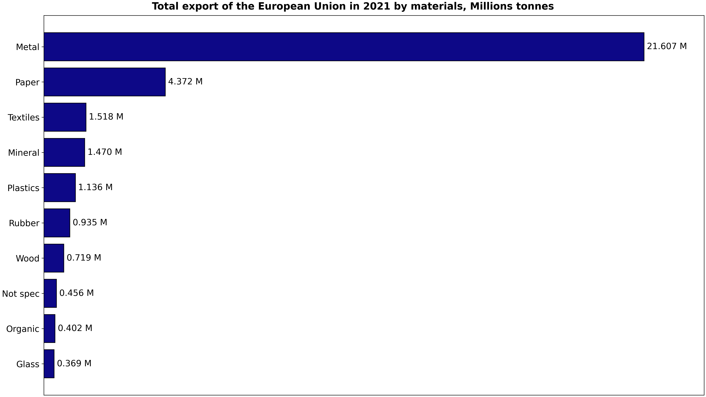

# EU Waste Trade Analysis (2004–2021)

    

## Project Description

  

This project analyzes the trade of waste the European Union with non-EU countries from 2004 to 2021. The analysis includes waste import and export data measured in tonnes and thousands of euros. Data source is [Kaggle dataset from Original Eurostat data](https://www.kaggle.com/datasets/konradb/european-waste-export-2004-2020/data?select=aggregate_trash.csv).

The data used in this project is provided under the CC0 1.0 Universal (Public Domain Dedication) license. This means the data is free to use, share, and adapt without restriction. 

The project workflow involves cleaning the data with Python, organizing it into a MySQL database, performing preliminary data exploration, and visualization in Python and Flourish.

  
Click to view workflow

## Workflow
### 0. **Extract all from data.zip to a new folder \data**

### 1. **Review and clean CSV Files**
- Execute the Python script `divide_aggregate_trash.py`
  - Remove trades of materials and partners subcategories to avoid aggregation conflicts.
  - Split `aggregate_trash.csv` into two files: `import_trash.csv` and `export_trash.csv`.
  - Pivot original data to reduce number of trade raws. Final files contain waste trade values in tonnes and thousands of euros, categorized by material, partner country, EU country, and year.

### 2. **Create Database and Tables**
- Execute the SQL script `create_eu_waste_trade_db.sql` to create the database structure and tables.

### 3. **Import Data**
- Place the following CSV files in the directory defined by the `secure-file-priv` variable in MySQL:
  - `geo_labels.csv`
  - `material_labels.csv`
  - `partner_labels.csv`
  - `import_trash.csv`
  - `export_trash.csv`
- Execute the script `import_data_to_eu_waste_trade_db.sql` to import the data into the corresponding tables.

### 4. **Check Data**
- Manually compare selected values by countries, years in the MySQL database against the original data on [Eurostat data](https://ec.europa.eu/eurostat/databrowser/view/ENV_WASTRDMP__custom_6104729/).

### 5. **Optimize Tables**
- Execute the script `alter_eu_waste_trade_db.sql` to add indexes to the database tables.

### 6. **Analyze Data**
- Execute scripts to compute key metrics:
  - `view_eu_export_import_by_years.sql`
  - `view_eu_export_by_years_materials.sql`
  - `proc_top_n_export_partners_of_country_by_years.sql`

### 7. **Export Data**
- Export data to csv-files with the help of MySQL Workbench and place them in \results folder.
  - `eu_export_import_by_years.csv`
  - `eu_export_by_years_materials.csv`
  - `top_10_export_partners_by_years.csv`

### 8. **Visualize Data in Python**
- Execute Python scripts to visualize data and save results:
  - `visual_eu_export_import_by_years.py`
  - `visual_eu_export_by_years_materials.py`
  - `pivot_top_10_export_partners_by_years.py`
    
### 9. **Visualize in Flourish**
- Add to data `eu_top_10_export_partners.csv` image urls of country flags from Flourich with the help of Google Sheets.
- Load data to Flourish.
- Set animation parameters in Flourish.

  

  

## Results
### 1. Total Export and Import Waste Trade of EU with Non-EU Countries (2004–2021)

  

From 2004 to 2021, the European Union experienced significant changes in its waste trade with non-EU countries:

- **Waste Exports:** The total value increased fourfold, soaring from €5.04 billion to €20 billion. This growth was accompanied by a rise in volume, from 18.66 million tonnes to 32.98 million tonnes.
- **Waste Imports:** The total value grew significantly, from €5.6 billion to €19 billion, while the volume remained relatively stable, increasing only slightly from 17.71 million tonnes to 19.75 million tonnes.

**SQL Query:** [view_eu_export_import_by_years.sql](scripts/view_eu_export_import_by_years.sql)

**Python visualization:** [visual_eu_export_import_by_years.py](scripts/visual_eu_export_import_by_years.py)

  
Table of EU total exports and imports by years

  
| Year | Tonnes of export | Thousand euros of export | Tonnes of import | Thousand euros of import |
| ----------- | ------------ | --------------------- | ------------ | --------------------- |
| 2004 | 18655562 | 5039013.6 | 17708518 | 5579673.9 |
| 2005 | 18832230 | 6010143.7 | 17354622 | 5862903.7 |
...
| 2020 | 32807186 | 12961870.8 | 16008408 | 13467221.3 |
| 2021 | 32983442 | 20014174.6 | 19746409 | 19011603.7 |

  

### 2. Export waste materials of the EU 

  

Waste materials are grouped according to the following classification:
- Plastics - waste, parings and scrap, of polymers of ethylene, styrene, chloride, propylene, acrylic polymers;
- Rubber - waste, parings and scrap of soft rubber and powders and granules obtained therefrom, used pneumatic tyres of rubber;
- Paper and cardboard - waste and scrap of paper or paperboard, old and unsold newspapers and magazines, telephone directories, brochures and printed
advertising material;
- Glass - cullet and other waste and scrap of glass;
- Textiles - cotton, flax, silk waste, waste of wool or of fine animal hair, nylon, acrylic, polyesters
- Organic - animal and vegetal origin;
- Wood - wood waste and scrap, whether or not agglomerated in logs, briquettes, pellets or similar forms;
- Metals - waste and scrap of cast steel, copper, aliminium, nickel, precious metals(gold, silver, platinum) and others;
- Minerals - slag, dross, scalings and other waste from the manufacture of iron or steel suitable for the recovery of iron or manganese or containing zinc, copper, aliminium, nickel, titanium;
- Not specified - waste pharmaceuticals, municipal waste, residual products of the chemical or allied industries.
  
In 2021, metal waste accounted for an impressive 65.51% of the total weight of the European Union's waste exports.

**SQL Query:** [view_eu_export_by_years_materials.sql](scripts/view_eu_export_by_years_materials.sql)

**Python visualization:** [visual_eu_export_by_years_materials.py](scripts/visual_eu_export_by_years_materials.py)

  

## Useful Links
- [Project Repository](https://github.com/ermusheva/eu_waste_trade)
- [Download the Dataset](https://www.kaggle.com/datasets/konradb/european-waste-export-2004-2020/data)
- [Contact Me](mailto:ermusheva@gmail.com)
